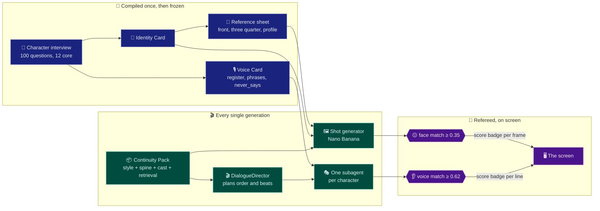
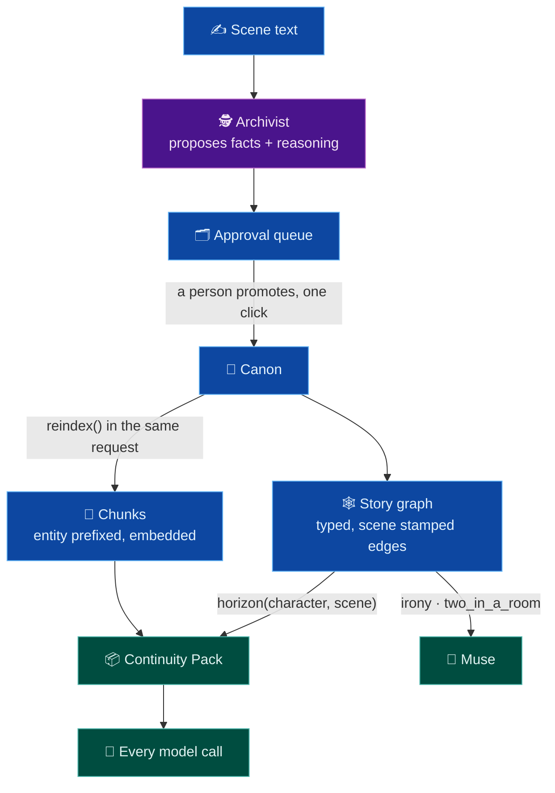

# 🎬 Magic Hour

**An AI filmmaking studio. Six tools that share one story bible, so nothing drifts.**


> Built in a day on a Vertex project shared with every other team in the room.
> Every number in this README was measured on this project, not guessed.

---

## 🍿 The problem, in one scene

Ask an image model for the same character twice and you get siblings. Ask a text
model to write her across a whole script and by scene 18 she is a different
person. Nothing looks broken at any single step. Every summary is a perfectly
good summary. The drift lives in the re-deriving.

Film crews solved this a century ago with a job title: **continuity**. Somebody
on set whose entire job is noticing that the coffee cup moved between takes.
Magic Hour is that person, built out of embeddings.

**The thesis: consistency is a property of the knowledge layer, not of any
single feature.** A character sounds the same in scene 18 as in scene 3 because
both calls read the same compiled Voice Card, byte for byte. A face holds from
shot 2 to shot 41 because both frames condition on the same locked reference
sheet. Then a referee measures every output against a stored fingerprint and
puts the score on screen where the filmmaker can see it.

So the rule everything else follows from: **compile identity once, store it,
reuse it verbatim, recompile only when canon changes, and measure every output
against what is stored.** Never re-derive.

## 🎛️ Six surfaces, one bible

| Surface | What it does for the filmmaker |
|---|---|
| 📖 **Bible** | The knowledge layer. Characters, scenes, locations, style. Everything reads from it. |
| ✍️ **Script** | A real screenplay editor (industry margins, Final Draft muscle memory) with a writing partner that knows the story and each character's voice. |
| 🎞️ **Board** | Storyboards, shot by shot, with characters whose faces stay the same and a score badge proving it. |
| 🎭 **Cast** | A 100 question interview that turns a name into someone who can speak. 12 core questions gate a character as castable. |
| 📍 **Scout** | Real locations for a scene. Real places, real photos, real coordinates, pinned to scene numbers. |
| 🔮 **Muse** | Talk through the story. It reads the graph: dramatic irony, and what two characters have on each other. |

## 🧠 Where the reasoning goes (and where it deliberately does not)

Model thinking is a budget, and it gets spent like one:

- **Compiling a card runs `gemini-2.5-pro` with thinking on.** It happens once
  per character and everything downstream reuses the result, so reasoning earns
  its keep here.
- **Speaking a line runs `gemini-2.5-flash` with thinking off**, because a
  character does not deliberate before speaking. (Also because Pro rejects
  `thinking_budget=0` outright. It always thinks. We measured that the hard way.)
- **Some reasoning is not a model call at all.** The knowledge graph closes over
  `implies` edges recursively: learning the route is cut implies the depot loses
  a shift, which implies someone is being moved. A character who learned the
  first fact can reason to the third. One who learned none of them cannot
  mention any. That is graph traversal, instant and free, doing work a prompt
  could only approximate.

## 🎭 The crew (a subagent per job, like an actual film set)

No single agent holds every character. That is the load bearing design choice:
one model doing impressions of three people is how voices blur together.

| Agent | Job on set | The trick |
|---|---|---|
| 🎬 **DialogueDirector** | Plans the running order and a beat for each turn of an exchange | Gets the camera visible brief and **nothing else**. One plan for the whole exchange, because a director who changes their mind every line directs nothing. |
| 🗣️ **Character subagents** | One per character in the scene, each speaks only its own lines | Each receives its own Voice Card **verbatim**. Never a summary of it. Summarizing per call is exactly what makes a voice drift. |
| 🎓 **DialogueCoach** | Compiles a missing Voice Card mid run so the scene can go on | Refuses if fewer than 12 core answers exist: writing that character would be inventing them, not writing them. |
| 🎥 **Director** (Board) | Plans coverage a director could actually shoot | Grounded in the same Continuity Pack the shot generator gets, so advice and output cannot disagree. |
| 🕵️ **Archivist** | Reads a scene and proposes what it establishes: facts, who learned them, when | **Never writes canon.** Everything lands in an approval queue with its reasoning attached. |
| 📋 **ScriptSupervisor** | Checks a drafted line against the speaker's knowledge horizon | Flags a character referring to something they have not learned yet. |
| 🗺️ **Location Scout** | Parses a director's plain language ask, runs a reasoning loop over Google Maps tools | Scores each candidate against the requested vibe, caches every photo to disk because Places URLs expire. |
| 😐 **Face referee** | Crops the face from every generated frame, embeds it, scores it | Badge on every frame. |
| 👂 **Voice referee** | Embeds every generated line, scores it against the character's fingerprint | Badge on every line. A rejected line goes back with the specific register axis that is off. |

Feedback works the way it does on a real set. When the writer cuts a line and
leaves a note, both ride back to the **same** subagent as direction, the way a
director talks to an actor. The Voice Card itself is never edited by feedback.
Who the character *is* stays frozen; how they play *this* moment adjusts.

## 🎼 How a scene gets made



The whole pipeline streams. Every generating endpoint returns Server Sent
Events in one envelope, so the client owns exactly one parser:

```
run_start · thinking · tool_call · tool_result · context · partial
shot_ready · line_ready · proposal · violation · run_end · error
```

You watch the DialogueDirector think, watch each subagent take its turn, watch
the referee pass or bounce each line, live.

## 🖼️ Multimodal, with the measurements to back it

**The generation.** `gemini-2.5-flash-image` (Nano Banana) holds a character's
face across a completely different composition and lighting setup when
conditioned on the reference sheet plus the frozen card text. That is the demo.

**The refereeing needed a spike to get right.** Whole frame embeddings cannot
judge identity. The numbers that proved it:

```
Maya's sheet vs Maya's shots (whole frame):   0.39  0.39  0.51
Ravi's sheet vs Maya's shots (whole frame):   0.20  0.28  0.31   <- control
Maya's sheet vs Ravi's sheet (whole frame):   0.48   <- two DIFFERENT people, scored HIGH
```

`multimodalembedding@001` encodes the entire image, so composition and lighting
swamp identity. Two reference sheets of two different people score 0.48 because
both are grey three view sheets. **The fix: a Gemini bounding box call crops
the face first, then the crop gets embedded.** Composition signal gone,
identity signal left.

**Style is pinned separately from identity.** The spike's reference sheet was
photoreal and the first shot came back as a digital painting, because the
prompt said "storyboard frame" and nothing pinned the medium. Now every shot in
a board carries the same style preset string verbatim.

**Scout is multimodal in the other direction.** It reads places: text search,
place details, photos, static maps, street view, and reasons about whether a
real Brooklyn corner matches "a wet night shift, nobody sleeping, everything
lit by the machines."

## 📏 The two numbers

Everything above is in service of two scores, and both are always on screen:

- 😐 **Face match, threshold 0.35.** Worst genuine same person crop must sit
  above the best different person crop. Calibrated from the spike.
- 👂 **Voice match, threshold 0.62.** Calibrated against **real generated
  lines**, not samples scored against their own centroid. That distinction
  matters: scoring a sample against a centroid it is part of inflates the
  number to 0.77 and would set the bar above anything real. Measured instead:
  generated Maya lines score 0.715 to 0.827 against Maya, the best cross
  character score is 0.613, and 0.62 sits in the gap.

A score that could not be measured reads **"no score"** rather than defaulting
to a pass. A referee that silently passes everything is worse than no referee.

## 📦 Context management: the Continuity Pack

One function, `build_pack()`, assembles context for **every model call in the
product**. Fixed slots, fixed budgets:

| Slot | What goes in | Why it is its own slot |
|---|---|---|
| 🎨 `style` | The style card, axis by axis | The look must be identical in every prompt or it drifts |
| 🦴 `spine` | Title, logline, story so far, the scene index | Cheap orientation nothing should have to retrieve |
| 👥 `cast` | Each character's frozen cards plus what they know **as of this scene** | Identity arrives verbatim, never re-summarized |
| 🔍 retrieval | Hybrid search hits for this specific ask | The long tail the fixed slots cannot carry |

The pack **reports what it did**, slot by slot, and that report rides the
`context` SSE event to a Trace tab in the UI. When a line comes out wrong you
open the tab and read the exact context the model received. That is the
difference between diagnosing a bad line in five seconds and in twenty minutes.

### 🤫 The knowledge horizon, or: how Ravi learned a secret from stage directions

The sharpest context bug of the build. The scene brief is shared with every
character subagent, and a first run put "Maya already knew and did not tell
him" in it. Ravi accused her on his third line, **because he read it in the
brief.** The model did nothing wrong. The context did.

The rule that came out of it: **`scene` is what a camera in the room could
see.** Anything one character knows and another does not goes in that
character's `knows` list, never in the shared brief. The DialogueDirector gets
the same treatment one level up: it plans the exchange from the camera visible
brief and nothing else, because a director who knows Maya's secret paces the
scene like everyone can feel it coming.

## 📚 Knowledge: stored once, shared everywhere



**Storing.** One chunk per semantic unit, each carrying a human readable prefix
naming its entity, which makes lexical matching and model comprehension both
better than a bare fragment. A row and its chunks are written together in the
same request, so there is no window where a fact and its index disagree.

**Retrieving.** Hybrid, because pure vector search fails on the things
screenplays are made of: "INT. MOTEL ROOM - NIGHT" and "the motel" are the same
place but are not neighbours in embedding space, and character names demand
exact matching. Two retrievers, vector plus token overlap, fused by reciprocal
rank. At roughly 50 chunks this is numpy cosine with an exhaustive scan, which
is faster than any index and needs zero infrastructure.

**Sharing, with a canon boundary.** Knowledge lives in two layers, canon and
draft. Agents propose into the queue, with the reasoning that produced each
proposal attached, and only a person promotes. That asymmetry is why the
Archivist is allowed to be aggressive: a wrong proposal costs one click, a
wrong write costs the story.

**And the graph on top.** Flat facts answer "what does Maya know by scene 3."
The typed edge table answers the questions a story actually runs on: who has
`met` whom, who is `lying_to` whom, who `wants_from` whom, who `owes`, `loves`,
`fears`. Every edge is scene stamped, `horizon()` closes over `implies`
recursively, `check_text()` is the ScriptSupervisor, and `irony()` plus
`two_in_a_room()` feed Muse. The graph pays for itself twice.

## 🚀 Run it

```bash
./scripts/dev.sh          # macOS, Linux, Git Bash      http://127.0.0.1:8080
.\scripts\dev.ps1         # PowerShell
```

First run creates `backend/.venv` and installs requirements, then it reloads on
save. **The app opens on a seeded story with no network call at all:** two
characters at 12 of 12 core answers with compiled cards, three scenes, real
locations, a four frame board, 44 indexed chunks. Demo assets are generated
once, cached to disk, and committed, so the venue wifi dying does not take the
board down with it.

To make live model calls work, once:

```bash
gcloud auth application-default login
gcloud auth application-default set-quota-project nyu-ai-builder26nyc-9338
```

⚠️ **That second line is not optional.** Without a quota project, ADC bills a
starvation tier bucket and every Vertex call returns 429 RESOURCE_EXHAUSTED,
which looks exactly like a broken app. Single most expensive gotcha here.

`GOOGLE_MAPS_API_KEY` in `backend/.env` turns on live Places search. Without
it, Scout returns the seeded locations and says so in the Trace tab.

## ☁️ Deploy

```bash
./scripts/deploy.sh
```

One Cloud Run service, `min-instances 1`, because cold starting a container
that imports the Vertex SDK takes four to eight seconds and on a demo stage
that reads as broken. The script smoke tests `/healthz` on the new revision
rather than trusting that a URL got printed.

## 🗺️ Where things are

```
backend/app/
  consistency.py    Identity Cards, reference sheets, the face crop referee
  voice.py          Voice Cards, per character subagents, the voice referee
  graph.py          typed story edges, the knowledge horizon, irony
  bible.py          chunks, hybrid retrieval, build_pack (the Continuity Pack)
  screenplay.py     the typed screenplay document model and parser
  extract.py        the Archivist: fact proposals into the approval queue
  interview.py      the front door: next question computed from story state
  store.py          entities and compiled cards, shaped like the Postgres schema
  questions.py      the 100 questions, 7 parts, 12 core
  seed.py           the seeded story, built from disk at startup
  sse.py            one event envelope for every stream
  images.py         frames to disk, served back over /cache
  agents/
    location_scout_agent.py   the Scout's reasoning loop over Maps tools
  api/              one router per surface: bible, cast, board, script, scout,
                    knowledge, interview, auth, health
  static/           the app shell
```

`http://127.0.0.1:8080/docs` has the live API schema.

**Do not reimplement `consistency.py`, `voice.py`, `tools/locations.py` or
`data/seed/character_questions.json`.** They are built and verified by real
calls. Add a surface by adding a module under `app/api/` that exposes `router`.
`main.py` mounts the API inside a try/except, so one half written tab cannot
stop the app from booting. **Never break the boot.**

## 🩹 Scar tissue (facts measured on this project, so nobody rediscovers them)

- Project id is **`nyu-ai-builder26nyc-9338`**. The credential card omits the
  numeric suffix and the short form fails with a misleading permission error.
- **Never `gemini-flash-latest` or `gemini-pro-latest`.** AI Studio only
  aliases, they 404 on Vertex. Use `gemini-2.5-flash` and `gemini-2.5-pro`.
- **Gemini 3 returns 404 here.** No Nano Banana Pro.
- `gemini-2.5-pro` rejects `thinking_budget=0`. Use flash when you need
  thinking off, and raise `max_output_tokens`, or reasoning eats the budget and
  the answer comes back truncated mid word.
- The SDK's `embed_content` fails on `multimodalembedding@001` with "Empty
  instances". It is a predict style model, so call REST.
- A truncated JSON extraction still holds four complete facts. The parser trims
  to the last complete object instead of throwing all five away.
- **Image generation runs about 30 seconds a frame** on a project shared with
  every team in the room. Cache every generated image to disk and commit it.
  Live generation on stage is a bonus that is allowed to fail.
- Cache the Vertex client. Constructing one per call gets it garbage collected
  mid flight and the next request dies with "client has been closed".
- Use `google.auth.default()`, never shell out to `gcloud`. gcloud does not
  exist in the Cloud Run container, so shelling out works locally and fails the
  instant you deploy.

---

📐 The full architecture is
[`docs/superpowers/specs/2026-07-25-magic-hour-design.md`](docs/superpowers/specs/2026-07-25-magic-hour-design.md).
The build plan that actually shipped is [`docs/NOW.md`](docs/NOW.md).
